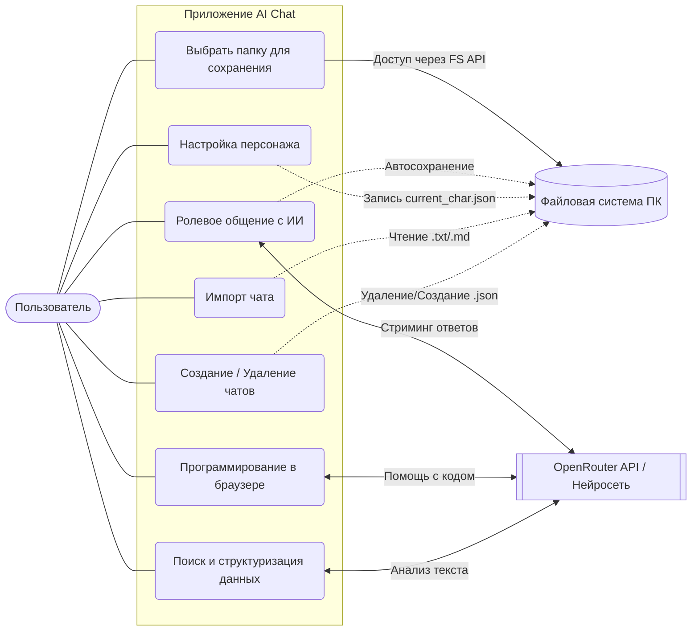
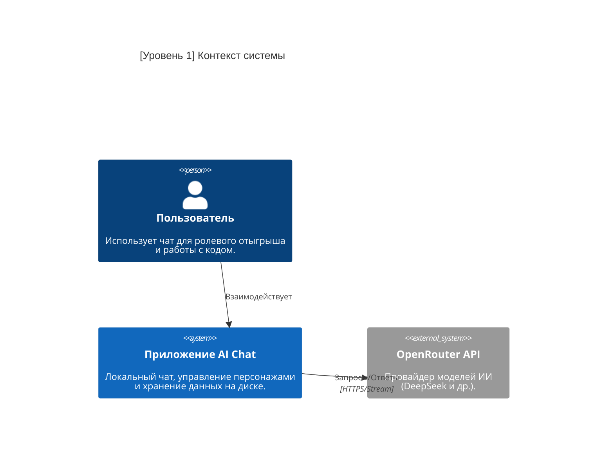

# Документация проекта: AI Chat

В этом документе описана структура проекта, основные механики и назначение ключевых файлов. Приложение представляет собой локальный ИИ-чат с поддержкой ролевого отыгрыша и сохранением данных прямо на жесткий диск пользователя.

## Назначение проекта

Данный проект направлен на облегчение работы с нейросетями и представляет собой универсальный сборник инструментов для повседневных нужд. Приложение может размещаться как локально на устройстве пользователя, так и на серверной инфраструктуре, в зависимости от варианта развертывания.

### Реализованные и планируемые функции

**1. Поиск и структуризация информации**
Данный модуль предназначен для автоматизации процесса сбора, анализа и систематизации данных из различных источников. Пользователь имеет возможность формировать запросы к нейросети с целью получения структурированных данных, создания сводок, резюмирования больших объемов текста и автоматизации документооборота. В дальнейшем планируется интеграция с внешними источниками данных для расширения функциональности.

**2. Ролевое общение с ИИ (RP чат)**
Основная функция приложения, предоставляющая возможность ведения диалога с искусственным интеллектом в заданном жанре, стиле или характере. Пользователь может создавать и настраивать персонажей, определять сценарии взаимодействия, задавать правила общения и сохранять историю переписки. Функция включает режим "строгого ролевого отыгрыша", предотвращающего выход ИИ из заданного контекста. Данный режим обеспечивает более глубокое погружение в ролевой сценарий.

**3. Универсальная IDE для программирования в браузере**
Встроенная среда разработки, позволяющая писать, редактировать, тестировать и отлаживать код непосредственно в браузере без необходимости использования сторонних инструментов. Модуль поддерживает работу с различными язык��ми программирования, интеграцию с нейросетью для помощи в написании кода, автоматическую проверку синтаксиса и предоставление рекомендаций по оптимизации. Данная функция находится в стадии активной разработки.

**4. Мультимодельный доступ**
Единый интерфейс для работы с различными моделями искусственного интеллекта. Пользователь имеет возможность переключаться между несколькими провайдерами и моделями без необходимости использования дополнительных приложений или сервисов. Функция обеспечивает унифицированный доступ к различным API, сравнение результатов работы разных моделей и выбор оптимального решения для конкретной задачи.

## Структура проекта

### Главные файлы

- src/App.tsx — Сердце приложения. Здесь находится весь пользовательский интерфейс, боковое меню, шапка, окно чата и логика связывания всех остальных модулей.
- src/main.tsx — Точка входа React-приложения.
- src/index.css — Глобальные стили и переменные цветов Tailwind CSS.

### Модуль файловой системы

- src/lib/fs-storage.ts — Отвечает за работу с жестким диском пользователя через File System Access API.
  Содержит функции: requestDirectoryAccess (запрос папки), saveFile (сохранение), readFile (чтение), deleteFile (удаление).
  Использует библиотеку idb-keyval, чтобы запомнить выбранную папку в браузере (IndexedDB) и не спрашивать её при каждом обновлении страницы.

### Модуль управления персонажем

- src/features/character-manager/types.ts — Описывает структуру данных персонажа (Имя, Промпт, Строгий режим, Факты).
- src/features/character-manager/prompt-builder.ts — Собирает все настройки персонажа в один большой системный промпт, который понимает нейросеть.

### Модуль импорта

- src/features/import-chat/parser.ts — Читает обычные txt или md файлы и превращает текст вида "User: привет" в понятный для приложения массив сообщений.

### UI компоненты

- src/components/ui/* — Папка с готовыми элементами интерфейса (кнопки, поля ввода, всплывающие окна). Они изолированы, чтобы их было легко переиспользовать и стилизовать.

## Как реализованы основные механики

### Общение с ИИ

При отправке сообщения вызывается функция handleSend в App.tsx.
Приложение берет последние 15 сообщений, чтобы ИИ помнил контекст, но не перегружалось.
Вызов осуществляется через REST API OpenRouter. Ответ возвращается по кусочкам (стриминг), поэтому текст печатается на экране плавно, а не появляется целиком через несколько секунд.
Модель: deepseek/deepseek-chat

### Локальное сохранение

Это современная фича браузеров. Вместо того чтобы отправлять ваши чаты на сервер, браузер просит вас выбрать папку на вашем ПК.
Приложение получает FileSystemDirectoryHandle (указатель на папку).
Внутр�� создаются папки chats и characters.
В App.tsx есть useEffect, который следит за массивом messages. Как только вы отправляете или получаете сообщение, этот хук автоматически перезаписывает файл чата.

### Удержание персонажа в роли

В prompt-builder.ts формируется системная инструкция. Если включен тумблер "Запрет на выход из роли", к промпту жестко приклеивается фраза "Ни при каких обстоятельствах не выходи из роли". Для нейросети системный промпт имеет наивысший приоритет, поэтому она перестает реагировать на попытки пользователя сломать бота.

## Как работают кнопки интерфейса

**Кнопка Выбрать папку**
Вызывает handleRequestFsAccess().
Открывает системное окно выбора папки. После выбора сохраняет права доступа в IndexedDB браузера и загружает историю чатов (meta.json).

**Кнопка Импорт**
Вызывает handleImportChat().
Создает невидимый input type="file", имитирует клик по нему. Когда пользователь выбирает txt файл, текст передается в parseChatFile, и на экране появляется загруженная переписка.

**Кнопка Шестеренка Настройки персонажа**
Открывает компонент Dialog. Все изменения в полях ввода сразу сохраняются в состояние character (React State).
При нажатии Сохранить вызывается handleSaveCharacter(), который записывает настройки в файл characters/current_char.json и сбрасывает текущую сессию ИИ, чтобы новые настройки применились к следующему сообщению.

**Кнопка Новый чат**
Вызывает handleNewChat().
Генерирует новый уникальный ID, очищает экран (ставит только приветственное сообщение) и сбрасывает контекст нейросети.

**Кнопка Корзина в боковом меню**
Вызывает handleDeleteChat().
Физически удаляет json файл чата с вашего жесткого диска через deleteFile(), затем обновляет список чатов в meta.json и убирает его из интерфейса.

## Обход цензуры

### Правовая оговорка

Данный проект разработан исключительно в образовательных и развлекательных целях. Разработчик не несет ответственности за действия пользователей и не имеет намерений нарушать действующее законодательство Российской Федерации, включая, но не ограничиваясь: Федеральный закон "О защите детей от информации, причиняющей вред их здоровью и развитию", Уголовный кодекс РФ, Кодекс об административных правонарушениях и иные нормативные акты.

### Ограничение доступа

Функция обхода цензуры не предназначена и не может использоваться для получения доступа к запрещенной информации, включая материалы, распространение которых запрещено законом: детская порнография, материалы экстремистского характера, пропаганда наркотиков, насилие и иные противоправные материалы. Система фильтрации контента со стороны используемой нейросети остается в силе и не может быть отключена на стороне приложения.

### Назначение функции

Единственной целью функции обхода цензуры является предоставление пользователю возможности вести более откровенное ролевое общение с искусственным интеллектом в рамках, допускаемых используемой нейросетью. Данная функция может включать: использование нецензурированной лексики (матерных выражений), откровенные разговоры на темы отношений, эмоций и личного характера, контент сексуального содержания в рамках, допускаемых моделью. Ответственность за соблюдение границ допустимого контента лежит исключительно на пользователе.


## Обход цензуры (позиция разработчика)

### Предпосылки создания функции

Функция обхода цензуры была разработана на основании многочисленных запросов пользователей различных сервисов искусственного интеллекта, которые выражали потребность в более гибком и персонализированном взаимодействии с ИИ. Несмотря на то что современные модели искусственного интеллекта обладают значительными возможностями, существующие ограничения и механизмы фильтрации контента не всегда соответствуют ожиданиям пользователей.

Большинство пользователей популярных платформ, таких как DeepSeek, Gemini, ChatGPT и аналогичных сервисов, сталкиваются с различными уровнями цензуры. Подобные ограничения могут выражаться в следующих формах: попытка ухода от темы, перефразирование ответов, смягчение формулировок или полный отказ от продолжения диалога на определенные темы. Следует отметить, что подобные ограничения могут быть обусловлены как стремлением избежать неуместного контента, так и требованиями действующего законодательства.

### Принципы проекта

Данный проект направлен на поиск и обработку информации в соответствии с действующим законодательством. Разработчик не имеет намерений способствовать поиску или использованию запрещенной информации каким бы то ни было образом. Основными целями проекта являются:

1. Предоставление пользователю возможности более открытого общения с искусственным интеллектом по его запросу в рамках, допускаемых используемой моделью. Будь это "отыгрышь определенного" персонажа и так далее.
2. Оказание помощи в повседневных задачах и реализации крупных проектов

### Ограничение ответственности

Автор не несет ответственности за использование инструмента пользователем. Каждый чат является индивидуальным, а информация, содержащаяся в нем, не подлежит распространению третьими лицами. Ответственность за соблюдение границ допустимого контента и соблюдение законодательства лежит исключительно на пользователе.

### Use Case




 


```mermaid
C4Container
    title [Уровень 2] Контейнеры

    Person(user, "Пользователь", "Взаимодействует с интерфейсом.")
    System_Ext(api, "OpenRouter API", "Обработка запросов ИИ.")

    Container_Boundary(app_boundary, "Браузер") {
        Container(web_app, "Web App (React)", "TS, Vite", "UI и бизнес-логика чата.")
        ContainerDb(idb, "IndexedDB", "Браузерное хранилище", "Хранит ключи доступа к ФС.")
    }

    Container(fs, "Файловая система", "Диск пользователя", "Хранит .json чаты и настройки.")

    Rel(user, web_app, "Использует")
    Rel(web_app, api, "API вызовы", "Stream")
    Rel(web_app, idb, "Читает/Пишет права")
    Rel(web_app, fs, "CRUD файлов", "FS API")
